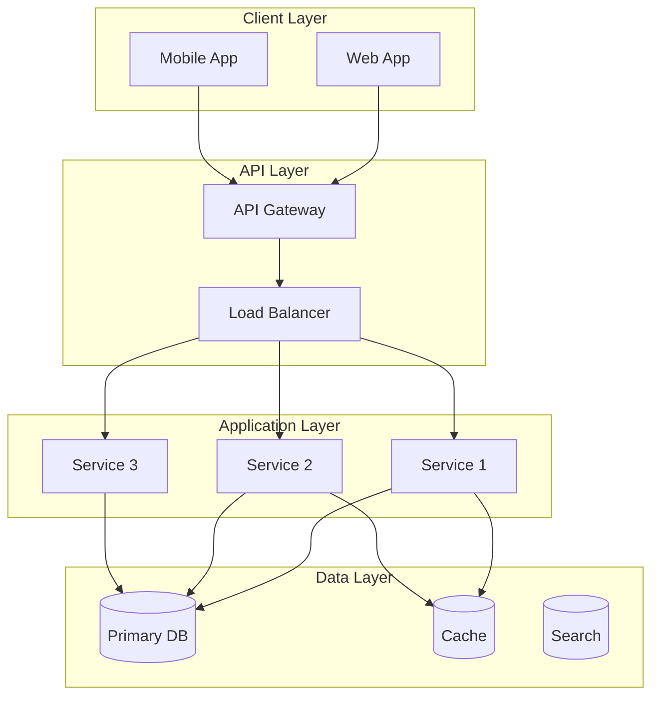
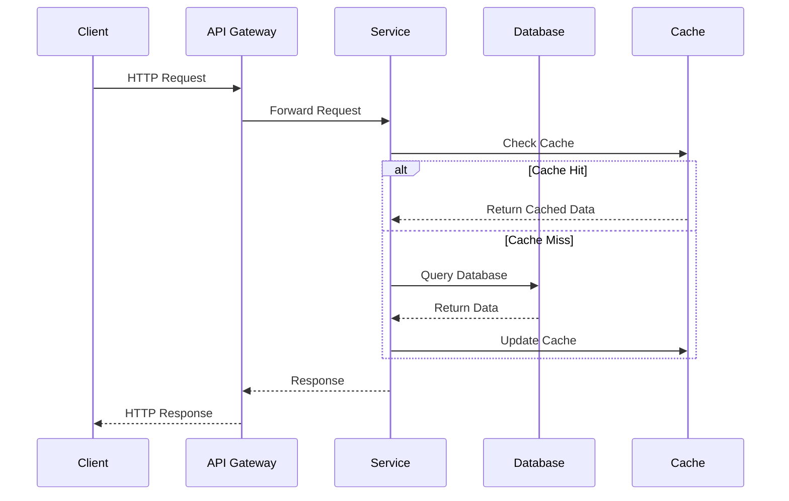

# Architecture: [System/Component Name]

## Executive Summary

### Overview

**System/Component:** [Full name]
**Scope:** System-wide | Subsystem | Service | Module | Component
**Status:** Planning | In Development | Production | Deprecated
**Version:** [Current version]
**Last Updated:** [Date]

**Purpose:**
> [2-3 sentences describing what this system does, why it exists, and its role in the larger architecture]

**Key Characteristics:**
- [Characteristic 1: e.g., "Microservices-based architecture"]
- [Characteristic 2: e.g., "Event-driven communication"]
- [Characteristic 3: e.g., "Horizontally scalable"]

## Context and Business Problem

### Business Context

**Problem Statement:**
[What business problem does this architecture solve?]

**Requirements:**
- [Functional requirement 1]
- [Functional requirement 2]
- [Non-functional requirement 1]
- [Non-functional requirement 2]

**Constraints:**
- [Constraint 1: e.g., "Must support 10K concurrent users"]
- [Constraint 2: e.g., "99.9% uptime SLA"]
- [Constraint 3: e.g., "GDPR compliance required"]

**Success Criteria:**
- [Criterion 1]
- [Criterion 2]
- [Criterion 3]

## High-Level Architecture

### System Overview

**Architecture Diagram:**

**Architecture Style:** [e.g., Microservices, Monolith, Event-Driven, Serverless, Layered]

**Key Design Patterns:**
- [Pattern 1: e.g., "CQRS - Command Query Responsibility Segregation"]
- [Pattern 2: e.g., "Event Sourcing"]
- [Pattern 3: e.g., "API Gateway pattern"]

## Components and Responsibilities

### Component Breakdown

#### Component 1: [Name]

**Responsibility:**
[What this component does]

**Key Functions:**
- [Function 1]
- [Function 2]
- [Function 3]

**Technology Stack:**
- Language: [e.g., TypeScript]
- Framework: [e.g., NestJS]
- Database: [e.g., PostgreSQL]

**Dependencies:**
- [Dependency 1]
- [Dependency 2]

**Location:** `path/to/component`

#### Component 2: [Name]

**Responsibility:**
[What this component does]

**Key Functions:**
- [Function 1]
- [Function 2]
- [Function 3]

**Technology Stack:**
- Language: [e.g., Python]
- Framework: [e.g., FastAPI]
- Database: [e.g., MongoDB]

**Dependencies:**
- [Dependency 1]
- [Dependency 2]

**Location:** `path/to/component`

## Data Flow and Communication

### Request Flow

**Sequence Diagram:**

**Communication Patterns:**
- **Synchronous:** [e.g., "REST APIs for client-server communication"]
- **Asynchronous:** [e.g., "Message queues for background processing"]
- **Event-Driven:** [e.g., "Event bus for service-to-service communication"]

## Data Architecture

### Data Models

**Key Data Entities:**

| Entity | Purpose | Storage | Schema Reference |
|--------|---------|---------|------------------|
| [Entity 1] | [Purpose] | [Database/service] | [Link to data model] |
| [Entity 2] | [Purpose] | [Database/service] | [Link to data model] |

**Data Storage:**
- **Primary Database:** [Database type and purpose]
- **Cache:** [Cache type and purpose]
- **Search:** [Search engine and purpose]

## Technology Stack

### Backend

| Technology | Version | Purpose |
|------------|---------|---------|
| [Language] | [Version] | [Purpose] |
| [Framework] | [Version] | [Purpose] |

### Infrastructure

| Technology | Version | Purpose |
|------------|---------|---------|
| [Cloud Provider] | N/A | [Purpose] |
| [Container] | [Version] | [Purpose] |
| [Orchestration] | [Version] | [Purpose] |

## Integration Points

### Internal Integrations

| Source Service | Target Service | Protocol | Purpose |
|----------------|----------------|----------|---------|
| [Service A] | [Service B] | [REST/gRPC/Events] | [Purpose] |

### External Integrations

| Service | Purpose | Integration Method | Documentation |
|---------|---------|-------------------|---------------|
| [Service 1] | [Purpose] | [REST API/SDK] | [Link] |

## Scalability and Performance

### Performance Targets

- **Response Time:** [Target: e.g., "< 200ms p95"]
- **Throughput:** [Target: e.g., "> 10K requests/sec"]
- **Availability:** [Target: e.g., "99.9% uptime"]

## Security Architecture

### Authentication

**Authentication Methods:**
- [Method 1: e.g., "JWT tokens for API authentication"]

### Authorization

**Authorization Model:** [e.g., RBAC, ABAC, ACL]

### Data Security

**Encryption:**
- **At Rest:** [Method]
- **In Transit:** [Method: e.g., "TLS 1.3"]

## Reliability and Resilience

### Fault Tolerance

**Failure Modes:**
- **Component Failure:** [How system handles it]
- **Database Failure:** [How system handles it]

**Recovery Objectives:**
- **RTO (Recovery Time Objective):** [Time]
- **RPO (Recovery Point Objective):** [Time]

## Monitoring and Observability

**Key Metrics:**
- [Metric 1]: [Description and threshold]
- [Metric 2]: [Description and threshold]

**Monitoring Tools:**
- **APM:** [Tool]
- **Infrastructure:** [Tool]
- **Dashboards:** Grafana

## Deployment Architecture

### Deployment Process

**CI/CD Pipeline:**
1. [Stage 1: e.g., "Build"]
2. [Stage 2: e.g., "Test"]
3. [Stage 3: e.g., "Deploy to Staging"]
4. [Stage 4: e.g., "Deploy to Production"]

**Deployment Strategy:**
- **Method:** [e.g., Blue-Green, Canary, Rolling]
- **Rollback Strategy:** [How to rollback]

## Trade-offs and Decisions

| Decision | Pros | Cons | Rationale |
|----------|------|------|-----------|
| [Decision 1] | [Pros] | [Cons] | [Why we chose this] |

### Technical Debt

**Known Issues:**
1. **[Issue 1]:** [Description, impact, and planned resolution]

**Future Improvements:**
1. **[Improvement 1]:** [Description and priority]

## References and Documentation

### Architecture Decision Records

Related ADRs:
- [ADR-XXX: Decision Title](knowledge/06-decisions/adr/...)

### Related Documentation

- **API Documentation:** [Link]
- **Data Models:** [Link]
- **Runbooks:** [Link]

## Change History

| Version | Date | Author | Changes |
|---------|------|--------|---------|
| 1.0.0 | YYYY-MM-DD | [Name] | Initial architecture document |

## Review and Approval

| Role | Name | Status | Date |
|------|------|--------|------|
| Architect | [Name] | Pending | |
| Tech Lead | [Name] | Pending | |
| Engineering Manager | [Name] | Pending | |
