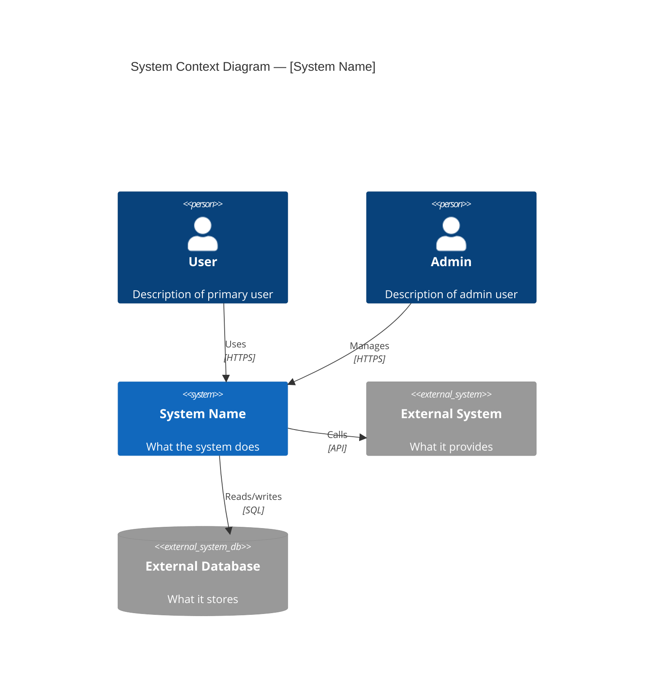
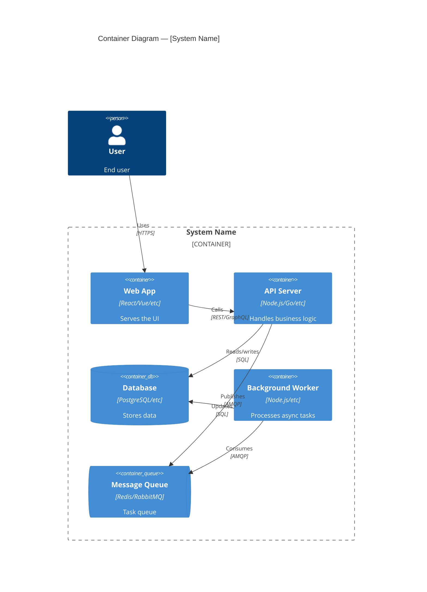
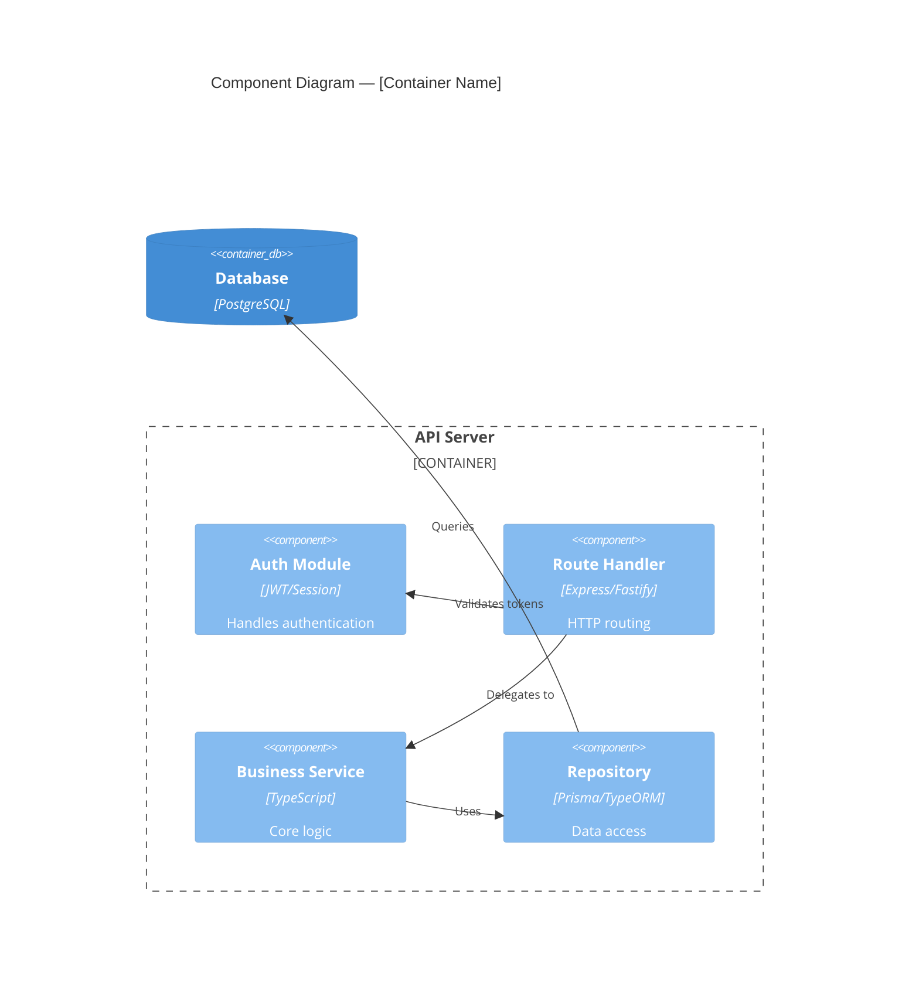
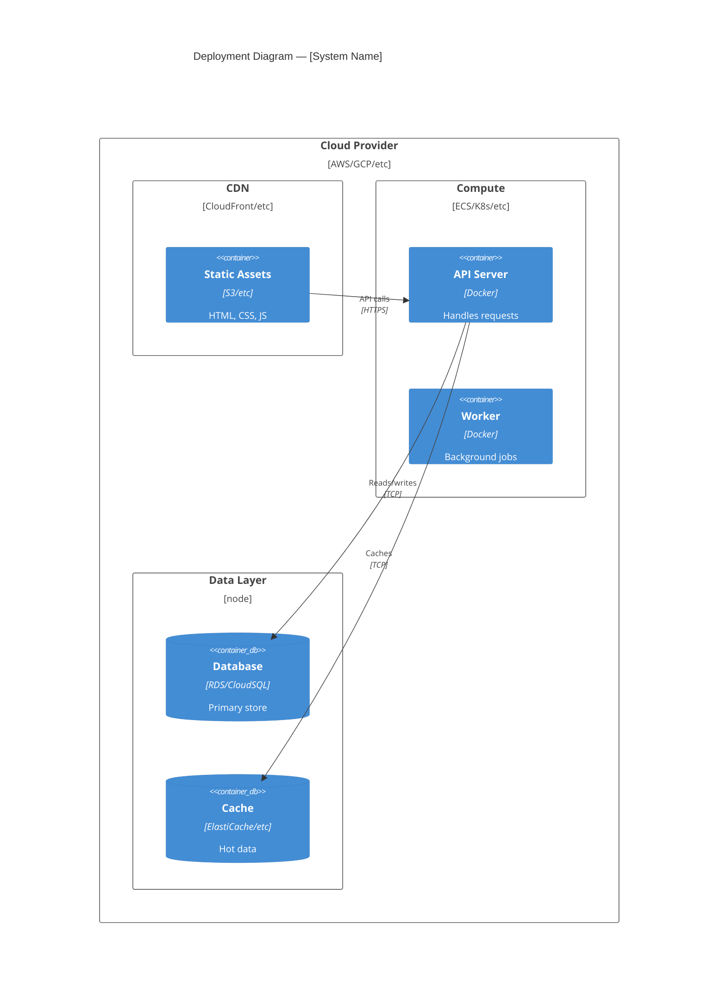
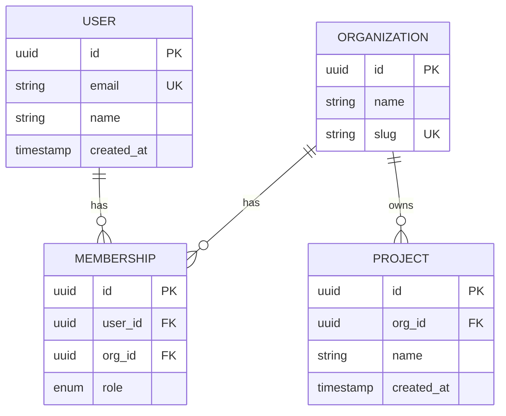
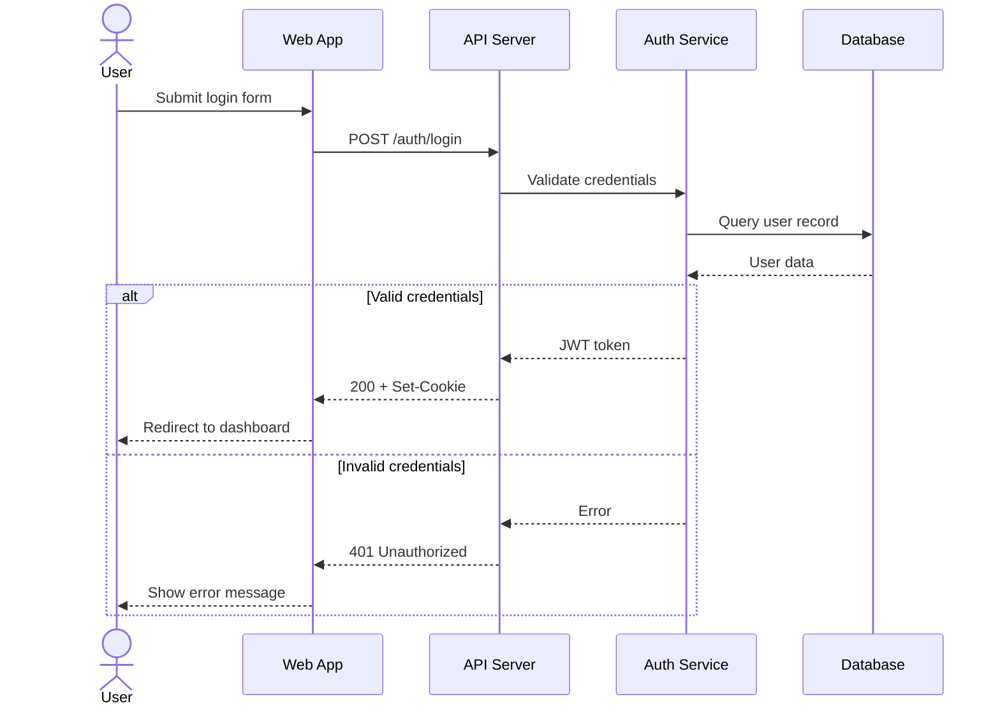
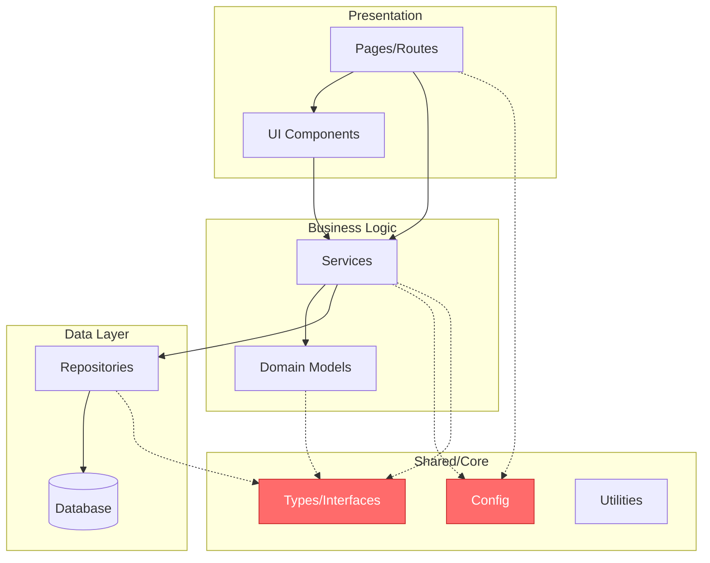
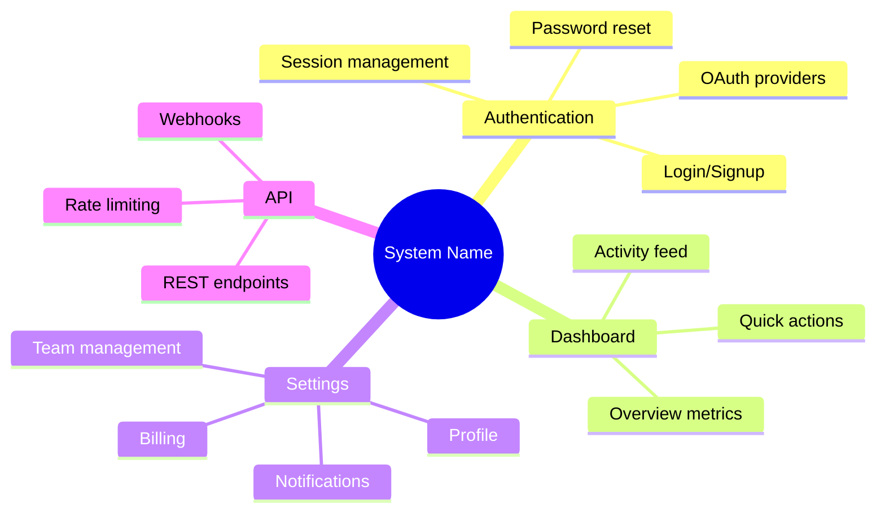

# Architecture Analysis Reference

Techniques for analyzing system structure, dependencies, and component relationships.

## Dependency Mapping

### Forward Dependencies

What a component relies on:
1. **Direct imports** — explicit dependencies in code
2. **Indirect references** — called through interfaces
3. **Runtime dependencies** — configuration, environment
4. **Data dependencies** — shared state, databases

### Reverse Dependencies

What relies on this component:
1. **Direct dependents** — explicit imports from other modules
2. **Interface consumers** — components using this API
3. **Side effect consumers** — code relying on mutations
4. **Event subscribers** — listeners for this component's events

### Circular Dependencies

Red flags:
- A imports B, B imports A
- Longer cycles: A → B → C → A
- Implicit cycles through shared state

Resolution strategies:
- Extract shared code to separate module
- Introduce interface/abstraction layer
- Invert dependency direction
- Break into smaller components

## Layer Identification

### Detecting Layers

Look for:
- **Directional flow** — data/control flows one way
- **Abstraction levels** — concrete → abstract as you ascend
- **Responsibility clustering** — similar concerns grouped
- **Interface boundaries** — clear contracts between groups

### Common Layer Patterns

**Three-tier**:
- Presentation (UI, API endpoints)
- Business logic (domain, workflows)
- Data access (repositories, queries)

**Hexagonal/Clean**:
- Core domain (entities, business rules)
- Application layer (use cases, orchestration)
- Infrastructure (frameworks, external services)
- Interfaces (controllers, adapters)

**Microservices**:
- Service boundary (API gateway)
- Service logic (domain per service)
- Data layer (per-service database)
- Cross-cutting (auth, logging, monitoring)

### Layer Violations

Violations indicate architectural drift:
- Lower layer imports higher layer
- Business logic in presentation layer
- Data access code in domain entities
- Infrastructure concerns leaking into core

### Architecture Smells

Beyond layer violations, detect these structural anti-patterns:

| Smell | Indicator | Impact | Detection |
|---|---|---|---|
| **God service** | One module with 30+ exported functions, 500+ importers | Single point of failure, impossible to modify safely | CodeIndex metrics: highest fan-in + highest function count |
| **Chatty API** | Sequence diagrams show 10+ calls between two services for one operation | Latency multiplication, fragile coupling | Trace request flows, count inter-service calls per operation |
| **Shared database** | Multiple services read/write same tables | Hidden coupling, schema changes break multiple services | Grep for table names across service boundaries |
| **Distributed monolith** | All services must deploy together, shared libraries everywhere | Worst of both worlds: distributed complexity without independent deployment | Check deploy scripts — if one service change triggers full redeploy |
| **Circular dependency** | A → B → C → A at service or module level | Cannot deploy, test, or reason about independently | CodeIndex circular_dependencies metric, or Kai dependency graph |
| **Data gravity** | One database accumulates all data regardless of domain | Performance bottleneck, schema becomes unmaintainable | Count tables per database, check if tables span multiple bounded contexts |
| **Missing abstraction** | Same 5-10 lines of code repeated across 4+ files | Fragile — bug fix must touch all copies | CocoIndex semantic search for similar patterns, or CodeIndex duplication metrics |

When documenting smells, include:
- **Severity:** How much risk does this create? (Low/Medium/High/Critical)
- **Blast radius:** What breaks if this smell causes a failure?
- **Remediation path:** Concrete first step to improve (not a full rewrite plan)

## Interface Analysis

### Contract Definition

Examine:
- **Input types** — what does it accept?
- **Output types** — what does it return?
- **Error modes** — what can fail, how?
- **Side effects** — mutations, I/O, state changes
- **Invariants** — what must always be true?

### API Quality Indicators

Strong interfaces:
- **Cohesion** — methods belong together
- **Minimal surface** — small, focused API
- **Clear contracts** — types tell the story
- **Stability** — changes don't cascade
- **Composability** — works well with others

Weak interfaces:
- **Kitchen sink** — unrelated methods bundled
- **Leaky abstractions** — implementation details exposed
- **Unstable** — frequent breaking changes
- **Rigid** — hard to extend or compose

## Component Relationships

### Relationship Types

| Type | Ownership | Lifecycle | Coupling |
|------|-----------|-----------|----------|
| **Composition** | Owns sub-components | Coupled | Strong |
| **Aggregation** | References others | Independent | Loose |
| **Dependency** | Uses interface | No ownership | Can swap |
| **Association** | Knows about | Weak | Bidirectional |

### Coupling Analysis

**Low coupling** (good):
- Communicate through interfaces
- Few shared assumptions
- Changes localized
- Easy to test in isolation

**High coupling** (risky):
- Direct field access
- Shared mutable state
- Knowledge of implementation
- Changes ripple widely

## Hub Detection

Hubs are files/modules with high fan-in (many dependents). They are architectural linchpins.

### Identifying Hubs

1. Count import references for each file using grep/search
2. Rank by number of importers
3. Classify:
   - **Hub** (5+ importers) — important, change carefully
   - **Critical hub** (10+ importers) — core infrastructure, high-risk changes
   - **Leaf** (0-1 importers) — safe to modify in isolation

### Hub Analysis Checklist

For each hub, document:
- What it exports (public API surface)
- Who depends on it (all importers)
- How stable it is (change frequency from git log)
- What would break if it changed (blast radius)
- Test coverage over hub's exports

## Architectural Pattern Recognition

### Layered Architecture

Indicators: Unidirectional dependencies (top → bottom), each layer uses only layer below.
Trade-offs: Simple and well-understood, but can become rigid with performance overhead.

### Event-Driven Architecture

Indicators: Pub/sub or message queues, decoupled components, async communication.
Trade-offs: Scalable and loosely coupled, but harder to reason about flow.

### Microservices

Indicators: Service per bounded context, independent deployment, API-based communication.
Trade-offs: Independent scaling, but distributed system complexity.

## Architecture Decision Records (ADR)

### Format

Each ADR captures one significant architectural decision:

```markdown
# ADR-{NNN}: {Decision title}

**Status:** Proposed | Accepted | Deprecated | Superseded by ADR-{NNN}
**Date:** {YYYY-MM-DD}
**Deciders:** {Who made or approved this decision}

## Context

What problem or situation prompted this decision? Include constraints, requirements, and forces at play. State facts, not opinions.

## Decision

What was decided. State it as a clear, direct sentence: "We will use PostgreSQL for the primary data store."

## Consequences

### Positive
- What becomes easier or better

### Negative
- What becomes harder or worse
- What trade-offs were accepted

### Risks
- What could go wrong with this decision
```

### When to Write ADRs

- Technology choice (database, framework, language)
- Architecture pattern adoption (event-driven, CQRS, microservices)
- Major refactoring direction
- Security model decisions
- API contract changes that affect external consumers

### Inferring ADRs from Code

Oracle infers implicit decisions when no formal ADR exists:

1. **Look for pattern consistency.** If all services use the same error handling pattern, that was a decision — document it.
2. **Check git blame on foundational files.** The initial commit of core infrastructure often has commit messages explaining "why".
3. **Identify deviations.** When one module breaks the pattern, document both the pattern and why this module deviates.
4. **Mark inferred ADRs.** Use `Status: Inferred` and `Confidence: 3/5` — these need validation with the team.

## Analysis Workflows

### Top-Down

1. **System boundaries** — what's in scope?
2. **Major components** — high-level modules
3. **Component interactions** — how they communicate
4. **Internal structure** — zoom into each component
5. **Implementation** — code-level details

### Bottom-Up

1. **Entry point** — main(), server start, UI root
2. **Call graph** — trace execution paths
3. **Cluster calls** — group related functionality
4. **Extract components** — identify logical boundaries
5. **Map relationships** — connect the pieces

### Targeted (for specific questions)

1. **Define question** — what are you trying to understand?
2. **Identify relevant code** — where does this happen?
3. **Trace dependencies** — what does it touch?
4. **Analyze impact** — what would changing this affect?
5. **Document findings** — capture insights

## Diagram Design Principles

### When to Use Which Diagram

| Question to Answer | Diagram Type | Max Nodes |
|---|---|---|
| What are the system boundaries and external deps? | C4 Context | 8-10 |
| What containers/services make up the system? | C4 Container | 10-15 |
| What components exist inside a container? | C4 Component | 10-12 |
| Where does everything run? | C4 Deployment | 12-15 |
| How does data flow through a request? | Sequence | 6-8 participants |
| What are the module dependencies? | Dependency Flowchart | 15-20 |
| What does the data model look like? | ERD | 10-15 entities |
| What features does the product have? | Mindmap | 20-30 leaves |

### Readability Rules

1. **Node limit.** If a diagram has more than 15 nodes, split it into sub-diagrams by domain or layer. One diagram answering one question is better than one diagram answering three.
2. **Minimize line crossings.** Rearrange nodes so dependency arrows flow in one direction (top-down or left-right). Crossed lines make the reader work harder.
3. **Label every arrow.** Unlabeled arrows are ambiguous. "Calls" vs "Subscribes to" vs "Reads from" — each implies different coupling.
4. **Consistent color meaning.** Define a legend if using colors. Example: blue = internal service, orange = external dependency, red = high-risk hub. Use the same palette across all diagrams in the project.
5. **Title every diagram.** The title states what question the diagram answers: "Container diagram — request processing pipeline" not just "Architecture".
6. **Group related nodes.** Use subgraph/boundary boxes to show logical grouping (layers, domains, teams). This reduces visual complexity.
7. **Show direction of dependency.** Arrow from A → B means "A depends on B" (A knows about B). Be consistent — never reverse the convention mid-doc.

## Mermaid Diagram Templates

Ready-to-use templates for visualizing architecture. Replace bracketed placeholders with your system's specifics.

### C4 Context Diagram

Use this to show the big picture: your system, its users, and external dependencies. Start here when explaining a system to stakeholders.



### C4 Container Diagram

Use this to show the major deployable units inside your system. Customize containers to match your actual tech stack.



### C4 Component Diagram

Use this to zoom into a single container and show its internal components. Best for documenting API server internals or complex services.



### C4 Deployment Diagram

Use this to show where containers run in production. Customize cloud provider, services, and infrastructure to match your setup.



### ERD (Entity Relationship Diagram)

Use this to document data models and their relationships. Customize entities, fields, and cardinality for your domain.



### Sequence Diagram

Use this to trace request flows through multiple components. Customize participants and the alt/else blocks for your authentication or business logic flows.



### Dependency Flowchart

Use this to visualize module dependency direction and identify architectural layers. Customize subgraphs and nodes to match your project structure. Hub nodes are highlighted in red.



## Oracle Integration Architecture

### Static Analysis + Direct Documentation Model

```
┌─────────────────────────────────────────────────────────────────┐
│ Phase 0: CodeIndex (Static Analysis Only)                        │
│                                                                 │
│   .codeindex/bin/codeindex generate --verbose                     │
│   ↓                                                             │
│   Produces:                                                     │
│   - docs/codebase_map.json (components, edges, metrics, hubs) │
│   - (graph.html.tpl lives in skill dir, not CodeIndex)         │
│   - docs/dependency_graphs/*.json (detailed dependency data)   │
│   - docs/templates/*.tpl (doc structure templates)             │
│                                                                 │
│   Does NOT produce:                                             │
│   - ❌ Module .md files (Oracle writes those)                   │
│   - ❌ module_tree.json (not in static-only mode)              │
│   - ❌ LLM-generated documentation                              │
└─────────────────────────────────────────────────────────────────┘
                              ↓
┌─────────────────────────────────────────────────────────────────┐
│ Phases 1-3: Oracle (Analyze + Write)                            │
│                                                                 │
│   /codebase-oracle                                              │
│   ↓                                                             │
│   1. Ingest CodeIndex static analysis data                      │
│   2. Read actual source code for each module/community         │
│   3. Analyze: structure, dependencies, patterns, rationale     │
│   4. Write all documentation from scratch                      │
└─────────────────────────────────────────────────────────────────┘
                              ↓
┌─────────────────────────────────────────────────────────────────┐
│ Output: Oracle-Written Documentation                            │
│                                                                 │
│   docs/                                                         │
│   ├── CODEBASE_MAP.md          (Oracle-written index)          │
│   ├── {module}.md              (Oracle-written module docs)    │
│   │   ├── Evidence inline (path:line references throughout)    │
│   │   ├── Failure Modes & Recovery                             │
│   │   ├── Blast Radius & Safe Change Plan                      │
│   │   ├── Design Rationale & Trade-offs                        │
│   │   └── <!-- ORACLE-META --> compact footer                  │
│   ├── codebase_map.json        (CodeIndex static analysis)     │
│   ├── graph.html               (AI-generated from skill's graph.html.tpl) │
│   ├── dependency_graphs/       (CodeIndex dependency data)     │
│   └── templates/               (CodeIndex doc templates)       │
└─────────────────────────────────────────────────────────────────┘
```

### Mindmap (Product Features)

Use this for high-level feature mapping or brainstorming. Customize the root and branches to match your product's feature areas.


