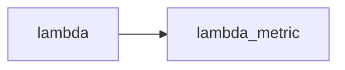

# Grafana Diagram Plugin Guide

The **grafana-diagram** plugin (marketplace: `jdbranham-diagram-panel`) enables creating dynamic, data-driven diagrams in Grafana using Mermaid.js syntax.

## Installation

```bash
# Via Grafana CLI
grafana-cli plugins install jdbranham-diagram-panel

# Or install from Grafana.com marketplace
# Settings > Plugins > Search "diagram"
```

Restart Grafana after installation.

## Using in JSON Dashboard

**Panel type ID:** `jdbranham-diagram-panel`

```json
{
  "type": "jdbranham-diagram-panel",
  "title": "Service Health Diagram",
  "gridPos": { "h": 8, "w": 12, "x": 0, "y": 0 },
  "targets": [
    {
      "datasource": "Prometheus",
      "refId": "A",
      "expr": "up{job=\"api\"}",
      "legendFormat": "{{instance}}"
    }
  ],
  "options": {
    "display": {
      "diagramDefinition": "graph LR\n    api --> db\n    api --> cache"
    }
  }
}
```

**Key fields:**
- `type`: Always `jdbranham-diagram-panel`
- `options.display.diagramDefinition`: Mermaid syntax string
- `targets`: Your data queries matching node IDs

## Adding Diagram Panel via UI

1. Open dashboard → Click **Add panel** (+ button)
2. In panel search box, type: `diagram`
3. Select **Diagram** (by jdbranham)
4. Panel editor opens on right side

## Quick Start

### Basic Mermaid Diagram

```
graph LR
    A --> B
    B --> C
    C --> A
```

### Named Nodes with Icons

```
graph LR
    LB[Load Balancer] --> web1
    web1 --> app1(fa:fa-check App1)
    web1 --> app2(fa:fa-ban App2)
    app1 --> DB[(Database)]
```

**Icon prefix**: `fa:fa-{icon-name}` (Font Awesome 5)

## Data Binding - The Core Feature

### How It Works

1. Define nodes with IDs in Mermaid syntax
2. Query returns metric series with aliases matching those IDs
3. Plugin matches series alias to node ID and applies color based on value/thresholds

### Character Replacement

Special characters in metric names are auto-replaced with underscore:
```
" , ; = : { } /
```

Example: `metric-name` becomes `metric_name`

### Example: Binding Metrics to Nodes

**Mermaid Definition:**
```
graph LR
    api --> auth
    api --> db
    auth --> user_db
```

**Query aliases should be:** `api`, `auth`, `db`, `user_db`

**Or use explicit names:**
```
graph LR
    api_gateway[API Gateway] --> auth_service[Auth Service]
```

Query aliases: `api_gateway`, `auth_service`

### Critical: Time Field Required for Mermaid Binding

`jdbranham-diagram-panel` only binds/updates nodes for series that include a **time field**.
If your query returns only a single table value (no time column), stat cards may show data but Mermaid nodes will not update.

This comes from plugin behavior in `getDiagramSeriesModel` (`getTimeField(...)` is required; series without time are skipped).

Use:
- `format: "time_series"`
- `time` column in milliseconds
- metric alias matching your Mermaid node ID/text

MySQL example (working):

```sql
SELECT
  FLOOR(UNIX_TIMESTAMP(Timestamp) / 60) * 60 * 1000 as time,
  COALESCE(
    ROUND(
      SUM(CASE WHEN StatusCode = 'Error' THEN 1 ELSE 0 END) * 100.0 / NULLIF(COUNT(*), 0),
      2
    ),
    0
  ) as lambda_metric
FROM otel.otel_traces
WHERE $__timeFilter(Timestamp)
  AND ServiceName LIKE 'orderfns%'
GROUP BY time
ORDER BY time
```

### Text/Value Rendering Behavior

- `{{value}}` inside Mermaid labels is **not** a guaranteed templating mechanism.
- Plugin appends metric value to a matched node when binding succeeds.
- For reliable matching, use a dedicated metric node with alias text in quotes, e.g.:



- Keep labels with special characters quoted, e.g. `node["Error Rate (%)"]`, to avoid Mermaid parse errors.
- Avoid keeping empty/placeholder targets (e.g. `refId` with no SQL); keep one clean target per metric to reduce ambiguity.

## Thresholds and Colors

### Setting Thresholds

In panel editor > Field options > Standard options > Thresholds:

```
Green: 0-50
Yellow: 50-80
Red: 80-100
```

### Indicator Mode

- **Text color**: Colors the node text based on threshold
- **Background color**: Fills the node shape with threshold color

## Metric Composites

Combine multiple metrics for a single node. The "worst" threshold wins.

**Composite Definition in Panel Editor:**
```
Name: xyz
Metrics: A-series, B-series
```

**Diagram uses composite name:**
```
graph LR
    xyz[Combined Status]
```

If `A-series` is green but `B-series` is red, `xyz` shows red.

## Value Mapping

Convert numeric values to text:

| Value | Text |
|-------|------|
| 0     | OK   |
| 1     | WARN |
| 2     | CRIT |

Display: Node shows "OK" (green), "WARN" (yellow), "CRIT" (red)

## Using Grafana Variables

Variables in diagram are auto-replaced:

```
graph LR
    $server --> $database
    $database --> $cache
```

## Mermaid Syntax Reference

### Flowchart (LR/RL/TD/BT)

```
graph LR
    A[Start] --> B{Decision}
    B -->|Yes| C[Action 1]
    B -->|No| D[Action 2]
    C --> E[End]
    D --> E
```

### Sequence Diagram

```
sequenceDiagram
    User->>API: Request
    API->>DB: Query
    DB-->>API: Result
    API-->>User: Response
```

### Gantt Chart

```
gantt
    title Project Timeline
    dateFormat  YYYY-MM-DD
    section Design
    Research     :a1, 2024-01-01, 7d
    Prototype    :a2, after a1, 14d
    section Dev
    Backend     :b1, after a2, 21d
    Frontend    :b2, after b1, 14d
```

### State Diagram

```
stateDiagram-v2
    [*] --> Idle
    Idle --> Processing: Start
    Processing --> Success: Complete
    Processing --> Error: Fail
    Success --> [*]
    Error --> Idle: Retry
```

### Entity Relationship Diagram

```
erDiagram
    USER ||--o{ ORDER : places
    ORDER }|--|{ LINE_ITEM : contains
    PRODUCT ||--o{ LINE_ITEM : "included in"
```

### Journey Diagram

```
journey
    title User Checkout Flow
    section Login
      Enter credentials: 5: User
      2FA prompt: 3: User
    section Checkout
      Add items: 5: User
      Payment: 4: User, System
```

## Advanced Features

### Custom Theme

Panel Editor > Display > Theme > Custom

Define colors for:
- Primary (lines/arrows)
- Fill (node background)
- Font (text color)
- Edge labels

### CSS Override

Panel Editor > Display > CSS Override

```css
.node rect {
  stroke-width: 3px;
}
.edgePath .path {
  stroke-width: 3px;
}
```

### Field Overrides

Per-series configuration:
- Different thresholds per metric
- Custom decimal precision
- Different aggregation (min/max/mean/last/current)
- Custom units

### Link Metrics

Link text to metric value in double quotes:

```
graph LR
    A["metric_A"] --> B["metric_B"]
```

## Best Practices

1. **Keep diagrams simple** - Complex diagrams are hard to read
2. **Use meaningful node IDs** - Match your metric naming convention
3. **Limit nodes** - 10-15 nodes max for clarity
4. **Color consistently** - Use same thresholds across all nodes
5. **Test with data** - Verify metric aliases match node IDs exactly
6. **Use subgraphs** - Group related components
7. **Label edges clearly** - Show relationship types

### Subgraph Example

```
graph TB
    subgraph Frontend
        FE1[Web App]
        FE2[Mobile App]
    end
    subgraph Backend
        API[API Gateway]
        SVC[Service]
    end
    FE1 --> API
    FE2 --> API
    API --> SVC
```

## Common Patterns

### Service Health Monitor

```
graph LR
    LB[Load Balancer]
    LB --> S1[Server 1]
    LB --> S2[Server 2]
    LB --> S3[Server 3]
    S1 --> DB[(Database)]
    S2 --> DB
    S3 --> DB
```

Query: Ping/HTTP status for each server and DB.

### Pipeline Status

```
graph LR
    GIT[Git] --> CI[CI/CD]
    CI --> STAGE[Staging]
    STAGE --> PROD[Production]
    PROD --> MONITOR[Monitoring]
```

Query: Build/deploy status metrics.

### Infrastructure Overview

```
graph TB
    subgraph "Data Center A"
        LB1[LB]
        APP1[App Cluster]
    end
    subgraph "Data Center B"
        LB2[LB]
        APP2[App Cluster]
    end
    LB1 --> DB[(Primary DB)]
    LB2 --> DB
    DB --> REPL[(Replica DB)]
```

## Troubleshooting

### Nodes not colored?
- Check metric aliases exactly match node IDs (after character replacement)
- Verify query returns data
- Check thresholds are configured
- Ensure time range has data
- Ensure query has a `time` field and panel target uses `format: "time_series"` (required for diagram binding)

### Diagram not rendering?
- Validate Mermaid syntax at [mermaid.live](https://mermaid.live)
- Check browser console for errors
- Try simpler diagram first
- Quote labels containing `%`, parentheses, or punctuation (example: `node["Error Rate (%)"]`)

### Wrong colors showing?
- Verify threshold values
- Check aggregation method (last/max/min)
- Ensure numeric data types

### Stat shows data but Mermaid node is empty?
- Stat panel can render table-only single values; diagram panel cannot bind those without time series.
- Convert diagram query to time series (`time` + metric alias).
- Confirm alias equals node ID/text after replacement rules.

## Resources

- **Plugin**: https://grafana.com/plugins/jdbranham-diagram-panel
- **Mermaid Docs**: https://mermaid.js.org/intro/
- **Mermaid Live Editor**: https://mermaid.live
- **Icons**: https://fontawesome.com/icons (Font Awesome 5)
