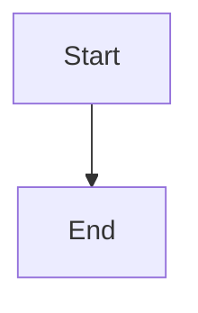
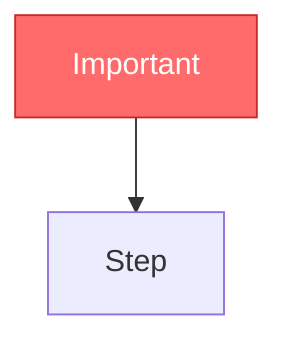

# Mermaid Diagram URL Generator

## 🚨 CRITICAL: NO MARKDOWN IN MERMAID CODE

Mermaid is NOT markdown. These will BREAK your diagram:

❌ `**bold**` - NEVER use double asterisks
❌ `*italic*` - NEVER use single asterisks
❌ `_underscore_` - NEVER use underscores for emphasis
❌ `[link](url)` - NEVER use markdown links
❌ `` `code` `` - NEVER use backticks inside labels
❌ `# headers` - NEVER use hash headers

✅ CORRECT: `A[User clicks button]`
❌ WRONG: `A[User **clicks** button]`
❌ WRONG: `A[User _clicks_ button]`
❌ WRONG: `A[See [docs](url)]`

## Use Mermaid v11 Syntax

Use `flowchart` NOT `graph`:



Use v11 shape syntax:


Available shapes: `rect`, `rounded`, `stadium`, `diamond`, `hex`, `cyl`, `doc`, `docs`, `delay`, `trap-t`, `trap-b`, `fork`, `cloud`, `odd`

Use styling instead of markdown:



## Generating Shareable URLs via mermaid.ink

[mermaid.ink](https://mermaid.ink) is a free, public, no-account service. It renders Mermaid diagrams from a URL-safe base64-encoded diagram source.

URL formats:
- **PNG image:** `https://mermaid.ink/img/<base64>`
- **SVG image:** `https://mermaid.ink/svg/<base64>`

### Bash one-liner

```bash
# Encode diagram source and build the URL
DIAGRAM='flowchart TD
    A[Start] --> B{Decision}
    B -->|Yes| C[Do Something]
    B -->|No| D[Do Nothing]
    C --> E[End]
    D --> E'

BASE64=$(printf '%s' "$DIAGRAM" | base64 | tr '+/' '-_' | tr -d '=\n')
echo "PNG: https://mermaid.ink/img/${BASE64}"
echo "SVG: https://mermaid.ink/svg/${BASE64}"
```

### Python snippet

```python
import base64

diagram = """flowchart TD
    A[Start] --> B{Decision}
    B -->|Yes| C[Do Something]
    B -->|No| D[Do Nothing]
    C --> E[End]
    D --> E"""

encoded = base64.urlsafe_b64encode(diagram.encode()).decode().rstrip("=")
print(f"PNG: https://mermaid.ink/img/{encoded}")
print(f"SVG: https://mermaid.ink/svg/{encoded}")
```

### Node.js snippet

```javascript
const diagram = `flowchart TD
    A[Start] --> B{Decision}
    B -->|Yes| C[Do Something]
    B -->|No| D[Do Nothing]
    C --> E[End]
    D --> E`;

const encoded = Buffer.from(diagram).toString("base64url");
console.log(`PNG: https://mermaid.ink/img/${encoded}`);
console.log(`SVG: https://mermaid.ink/svg/${encoded}`);
```

## Alternative: kroki.io

[kroki.io](https://kroki.io) supports many diagram types including Mermaid. It uses zlib deflate + base64 encoding:

```python
import base64, zlib

diagram = "flowchart TD\n    A --> B"
compressed = zlib.compress(diagram.encode(), 9)
encoded = base64.urlsafe_b64encode(compressed).decode()
print(f"https://kroki.io/mermaid/svg/{encoded}")
```

## Local Rendering with mermaid-cli

For offline use or CI pipelines, render diagrams locally with [mermaid-cli](https://github.com/mermaid-js/mermaid-cli):

```bash
# Render a .mmd file to PNG
npx @mermaid-js/mermaid-cli -i diagram.mmd -o diagram.png

# Render to SVG
npx @mermaid-js/mermaid-cli -i diagram.mmd -o diagram.svg
```

## Supported Diagram Types

All Mermaid diagram types are supported:

- `flowchart` / `graph` - Flow diagrams
- `sequenceDiagram` - Sequence diagrams
- `classDiagram` - Class diagrams
- `stateDiagram-v2` - State diagrams
- `erDiagram` - Entity relationship diagrams
- `gantt` - Gantt charts
- `pie` - Pie charts
- `mindmap` - Mind maps
- `timeline` - Timelines
- `gitgraph` - Git graphs
