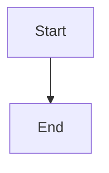
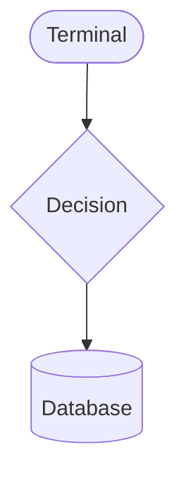
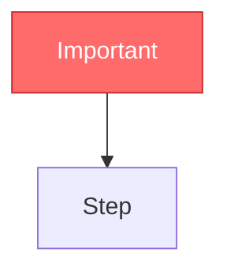

# MinimalMermaid URL Generator

Base URL: `https://mimaid.aiocean.dev/`

## 🚨 CRITICAL: NO MARKDOWN IN MERMAID CODE

Mermaid is NOT markdown. These will BREAK your diagram:

❌ `**bold**` - NEVER use double asterisks
❌ `*italic*` - NEVER use single asterisks
❌ `_underscore_` - NEVER use underscores for emphasis
❌ `[link](url)` - NEVER use markdown links
❌ `` `code` `` - NEVER use backticks inside labels
❌ `# headers` - NEVER use hash headers

✅ CORRECT: `A[User clicks button]`
❌ WRONG: `A[User **clicks** button]`
❌ WRONG: `A[User _clicks_ button]`
❌ WRONG: `A[See [docs](url)]`

## Use Mermaid v11 Syntax

Use `flowchart` NOT `graph`:



Use v11 shape syntax:



Available shapes: `rect`, `rounded`, `stadium`, `diamond`, `hex`, `cyl`, `doc`, `docs`, `delay`, `trap-t`, `trap-b`, `fork`, `cloud`, `odd`

Use styling instead of markdown:



## How It Works

MinimalMermaid stores diagram code in the URL hash using LZ-String compression:

- Compression: `LZString.compressToEncodedURIComponent(code)`
- Decompression: `LZString.decompressFromEncodedURIComponent(hash)`

## Generating URLs

Use JavaScript to generate shareable URLs:

```javascript
// Using lz-string library
const LZString = require("lz-string");

const mermaidCode = `flowchart TD
    A[Start] --> B{Decision}
    B -->|Yes| C[Do Something]
    B -->|No| D[Do Nothing]
    C --> E[End]
    D --> E`;

const compressed = LZString.compressToEncodedURIComponent(mermaidCode);
const url = `https://mimaid.aiocean.dev/#${compressed}`;
console.log(url);
```

## Quick Generation (Bash)

```bash
# Install lz-string if needed
bun add -g lz-string

# Generate URL using Node/Bun
bun -e "
const LZString = require('lz-string');
const code = \`flowchart TD
    A --> B\`;
console.log('https://mimaid.aiocean.dev/#' + LZString.compressToEncodedURIComponent(code));
"
```

## URL Parameters

| Parameter      | Usage          | Description                                    |
| -------------- | -------------- | ---------------------------------------------- |
| `#<hash>`      | `/#CYew5g...`  | Compressed diagram code (required for sharing) |
| `?room=<id>`   | `?room=myroom` | Enable real-time collaboration                 |
| `?name=<name>` | `?name=Alice`  | Set display name for collaboration             |
| `?hideEditor`  | `?hideEditor`  | View-only mode (hides editor pane)             |

## Common Patterns

### Share a Diagram

```javascript
const LZString = require("lz-string");
const code = `your mermaid code here`;
const hash = LZString.compressToEncodedURIComponent(code);
console.log(`https://mimaid.aiocean.dev/#${hash}`);
```

### Collaborate on a Diagram

```
https://mimaid.aiocean.dev/?room=project-planning&name=Alice#<hash>
```

### Embed View-Only

```
https://mimaid.aiocean.dev/?hideEditor#<hash>
```

## Supported Diagram Types

All Mermaid diagram types are supported:

- `flowchart` / `graph` - Flow diagrams
- `sequenceDiagram` - Sequence diagrams
- `classDiagram` - Class diagrams
- `stateDiagram-v2` - State diagrams
- `erDiagram` - Entity relationship diagrams
- `gantt` - Gantt charts
- `pie` - Pie charts
- `mindmap` - Mind maps
- `timeline` - Timelines
- `gitgraph` - Git graphs

## Example URLs

### Simple Flowchart

```javascript
const code = `flowchart LR
    A[Input] --> B[Process] --> C[Output]`;
// Generates: https://mimaid.aiocean.dev/#CYew5gLgpgBAYgdwDYBMCWA7ALgJwKYzCQAUJAUANQD0+ANCLgM4gDmIAxlQN4C+oAZuRhRYAIz79BIOA2bkQYUJFgByPgG4QAen0A6AAphYhYqXKVITAMYgL0ONXSyRBgExA
```

### Sequence Diagram

```javascript
const code = `sequenceDiagram
    Alice->>Bob: Hello Bob!
    Bob-->>Alice: Hi Alice!`;
// Generates: https://mimaid.aiocean.dev/#CYQwLgBA9gTgpgOwC4FcDOA7ALiATgVxGGAGEB7EAGxAGMB7MAZxoG9i6B+AFxADNg5ACYguIAHS5C+UWIkAaEAEYZs2VPnzBAbnoAGaeIqNQA
```

## Features

- **AI-Powered**: Generate diagrams using natural language with Google Gemini
- **Real-time Collaboration**: Multiple users can edit simultaneously
- **Auto-Save**: URL updates automatically as you type
- **Pan & Zoom**: Navigate large diagrams easily
- **Export**: Copy SVG or download PNG
- **Syntax Highlighting**: Monaco editor with Mermaid support
