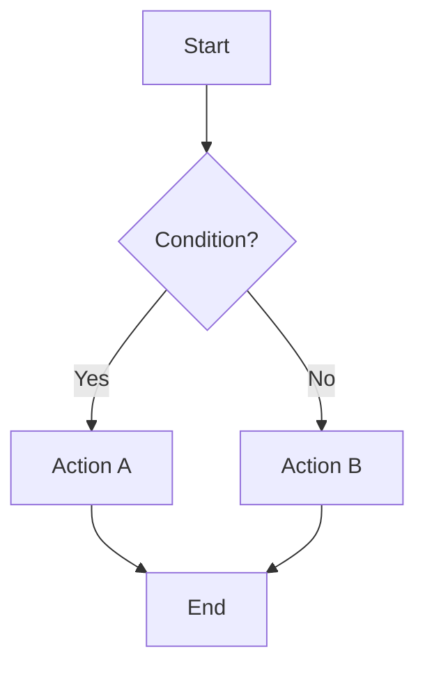
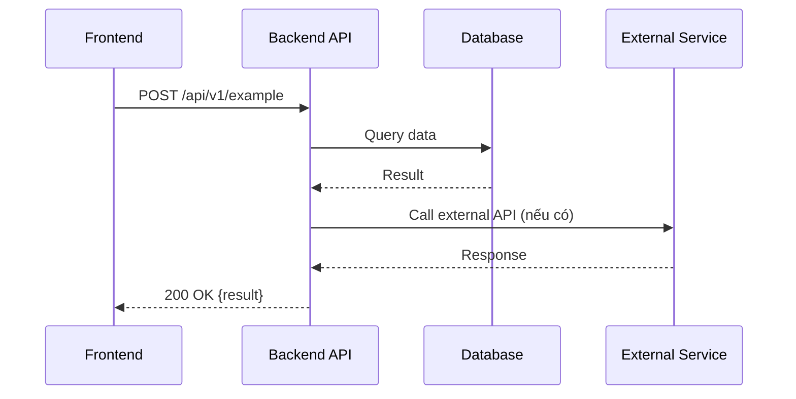

# Solution: [Tên feature / Mô tả ngắn]

**Story:** [PROJ-XXX](link-to-jira-story)

**Author:** [Tên engineer(s)]

**Status:** Draft | In Review | Approved | Updated

**Last Updated:** YYYY-MM-DD

---

## Bối cảnh

[Mô tả ngắn gọn vấn đề cần giải quyết, user story, và mục tiêu. 2-3 câu.]

## Solution Overview

[Tổng quan solution trong 3-5 câu. Người đọc phải hiểu được cách tiếp cận chính mà không cần đọc chi tiết.]

---

## Diagrams

> **Quy tắc diagram:** Dùng Mermaid syntax để vẽ trực tiếp trong Jira/Markdown.

### Flow Diagram (bắt buộc)

Mô tả luồng xử lý chính của feature. **Bắt buộc khi:** mọi story.



### Sequence Diagram (bắt buộc khi có tương tác giữa 2+ services/layers)

Mô tả thứ tự gọi giữa các thành phần. **Bắt buộc khi:**
- FE gọi BE (FE ↔ BE story)
- Service gọi service khác (inter-service communication)
- Có tương tác với external service (Shopify, Stripe, queue, ...)



### Khi nào cần diagram nào?

| Diagram | Bắt buộc khi | Ví dụ |
|---------|-------------|-------|
| **Flow Diagram** | Mọi story | Logic xử lý, user flow, decision tree, state machine |
| **Sequence Diagram** | Có 2+ components tương tác | FE↔BE, service↔service, service↔queue↔worker |
| **ER Diagram** | Thay đổi data model / thêm collection | Thêm field, tạo collection mới, thay đổi relationship |
| **State Diagram** | Feature có nhiều trạng thái chuyển đổi | Order status flow, subscription lifecycle |

> Nếu không chắc cần diagram nào, hỏi: "Có ai khác ngoài tôi cần hiểu luồng này không?" — nếu có, vẽ diagram.

---

## Frontend (nếu có)

### UI Flow

[Mô tả luồng giao diện người dùng sẽ tương tác]

```
[Screen A] → [User Action] → [Screen B] → [Result]
```

### Components & State

- **Components thay đổi/thêm mới:**
  - `ComponentName` — mô tả vai trò
  - ...

- **State management:**
  - [Mô tả state nào thay đổi, store nào bị ảnh hưởng]

### API Calls

| Action | Method | Endpoint | Request | Response |
|--------|--------|----------|---------|----------|
| [Action] | GET/POST/... | `/api/...` | `{...}` | `{...}` |

---

## Backend (nếu có)

### API Endpoints

| Method | Endpoint | Mô tả | Auth |
|--------|----------|-------|------|
| POST | `/api/v1/...` | [Mô tả] | Required |

### Request / Response

**POST /api/v1/example**

Request:
```json
{
  "field": "value"
}
```

Response (200):
```json
{
  "result": "value"
}
```

Error cases:
- `400` — [Khi nào xảy ra]
- `404` — [Khi nào xảy ra]
- `500` — [Khi nào xảy ra]

### Business Logic

[Mô tả logic xử lý chính. Dùng pseudocode hoặc flowchart nếu cần.]

```
1. Validate input
2. Query database for X
3. If condition → do A
4. Else → do B
5. Return result
```

### Database Changes

- **Collection/Table:** [Tên]
- **Thay đổi:** [Thêm field, thêm index, migration, ...]
- **Schema mới:**
```json
{
  "new_field": "type — mô tả"
}
```

---

## Contract FE ↔ BE

[Phần này bắt buộc khi story liên quan cả FE và BE. Mô tả rõ ràng "giao kèo" giữa hai bên.]

- **API contract:** [Endpoint nào, format request/response nào]
- **Error handling:** [FE xử lý error từ BE thế nào]
- **Loading states:** [FE hiển thị gì khi đợi BE response]
- **Edge cases:** [Các trường hợp đặc biệt cần xử lý đồng bộ]

---

## Ảnh hưởng & Rủi ro

- **Services/modules bị ảnh hưởng:** [Liệt kê]
- **Breaking changes:** [Có/Không — chi tiết nếu có]
- **Rủi ro:** [Liệt kê rủi ro và cách xử lý]
- **Performance:** [Có concern gì về performance không]

---

## Lịch sử thay đổi

| Ngày | Người thay đổi | Nội dung thay đổi | Lý do |
|------|---------------|-------------------|-------|
| YYYY-MM-DD | [Tên] | Initial solution | — |
